# Reinforcement Learning for Adaptive Optics

<!-- create a table of contents skip the first header -->
## Table of Contents

- [Table of Contents](##Table-of-Contents)
- [Environment](##Environment)
    - [Image sharpening](###Image-sharpening)
    - [Dark hole](###Dark-hole)
    - [Image sharpening easy](###Image-sharpening-easy)
    - [Image centering](###Image-centering)
- [Results](##Results)
    - [Centering](###Centering)
        - [Evaluation](####Evaluation)
    - [Sharpening easy](###Sharpening-easy)
        - [Evaluation for 2 zernike modes](####Evaluation-for-2-zernike-modes)
        - [Evaluation for 5 zernike modes](####Evaluation-for-5-zernike-modes)
        - [Evaluation for 9 zernike modes](####Evaluation-for-9-zernike-modes)
        - [Evaluation for 14 zernike modes](####Evaluation-for-14-zernike-modes)
        - [Evaluation for 20 zernike modes](####Evaluation-for-20-zernike-modes)
- [Animations](##Animations)
    - [Sharpening easy with 20 zernike modes](###Sharpening-easy-with-20-zernike-modes)
        - [Baseline (no agent)](####Baseline-(no-agent))
        - [Best agent](####Best-agent)

## Environments

### Image sharpening

The goal of this environment is to maximize the Strehl ratio based on focal plane images. 

- Observation: The observed (noisy) image intensity in the focal plane. The image is normalized such that the values are always between 0 and 1. The image has a size of 96x96 pixels.
- Action: An array of commands to send to the actuators to reshape the deformable mirror. This is in units of radians and should have an absolute value smaller than 0.3 to avoid divergence. Default is 400 actuators.
- Reward: The Strehl ratio, which is a measure of image sharpness and is between 0 and 1.
- Things to consider: 
    * Partially observable Markov decision process: twin image problem  (image intensity and not the electric field)
    * Possible solution: provide the agent a history of observations and commands or through the use of agents that have intrinsic memory

Run the environment with the following command:

```python gym_ao/gym_ao/gym_sharpening.py```

### Dark hole 

The goal of this environment is to remove starlight from a small region if the image. 

- Observation: A measurement with information about the electric field in the dark hole region. The shape is N_probes x N_pixels, default is 5 x 499.
- Action: An array of commands to send to the actuators to reshape the deformable mirror. This is in units of radians and should have an absolute value smaller than 0.3 to avoid divergence. Default is 400 actuators.
- Reward: The log of the contrast (mean of the image intensity in the dark hole region divided by the peak intensity of the starlight).

Run the environment with the following command:

```python gym_ao/gym_ao/gym_darkhole.py```

### Image sharpening easy

The goal of this environment is to maximize the Strehl ratio based on focal plane images like in the image sharpening environment. The difference is that the aberrations from the atmosphere can always be corrected by the zernike modes of the deformable mirror. 

- Observation: The observed (noisy) image intensity in the focal plane. The image is normalized such that the values are always between 0 and 1. The image has a size of 96x96 pixels.
- Action: An array of commands to send to the actuators to reshape the deformable mirror. This is in units of radians and should have an absolute value smaller than 0.3 to avoid divergence. Default is with 20 modes of zernike.
- Reward: The Strehl ratio, which is a measure of image sharpness and is between 0 and 1.

Run the environment with the following command:

```python gym_ao/gym_ao/gym_sharpening_easy.py```

### Image centering

The goal of this environment is to minimize the distance between the center of the image and the center of the focal plane.

- Observation: The observed (noisy) image intensity in the focal plane. The image is normalized such that the values are always between 0 and 1. The image has a size of 96x96 pixels.
- Action: An array of commands to send to the actuators to reshape the deformable mirror. This is in units of radians and should have an absolute value smaller than 0.3 to avoid divergence. For this environment we only use 2 zernike modes (tip and tilt) to correct the aberrations.
- Reward: The negative of the distance between the center of the image and the center of the focal plane.

Run the environment with the following command:

```python gym_ao/gym_ao/gym_centering.py```


## Results

We use Weights & Biases to track the results of the experiments. 

### Centering

Find the training results [here](https://api.wandb.ai/links/adapt_opt/gbkd3qfs).

#### Evaluation

We evaluate each agent on 1000 episodes. Each episode is 100 steps long.

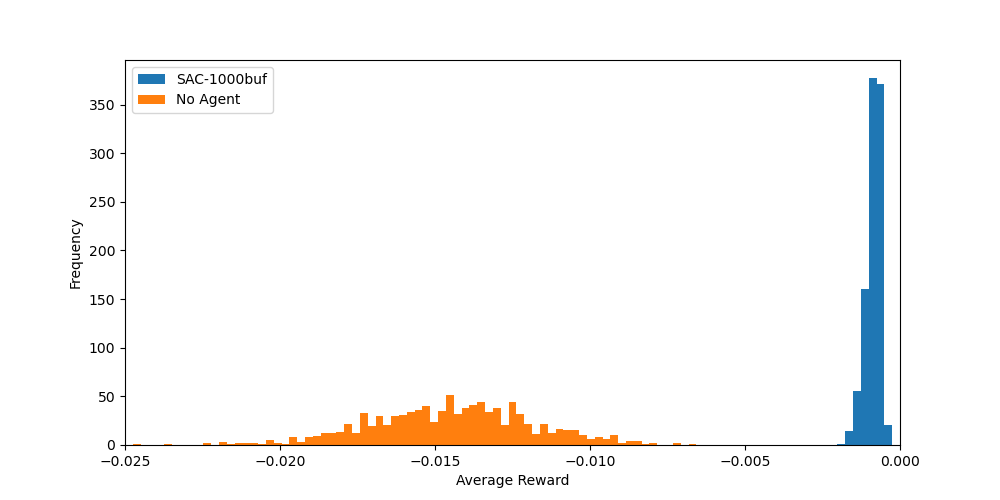

### Sharpening easy

We have trained agents on the sharpening easy environment with 2 and 5 and 9 zernike modes.
Reminder that for this environment the aberrations can always be corrected by the zernike modes of the deformable mirror that we use each time.

Find the training results [here](https://api.wandb.ai/links/adapt_opt/5y122g06).

#### Evaluation for 2 zernike modes

We evaluate each agent on 1000 episodes. Each episode is 100 steps long. 

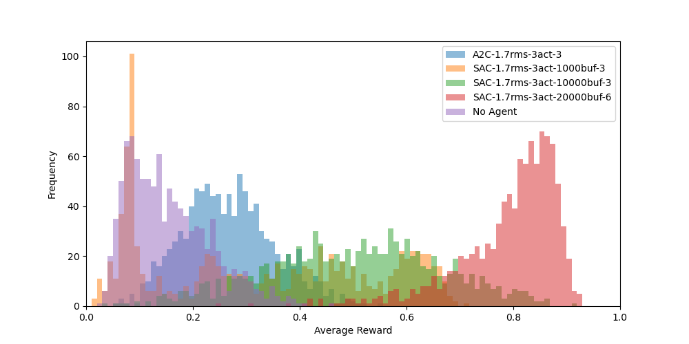

We also evaluate the best performing agent on 10000 episodes of 100 steps and compare it to the performance of the baseline.

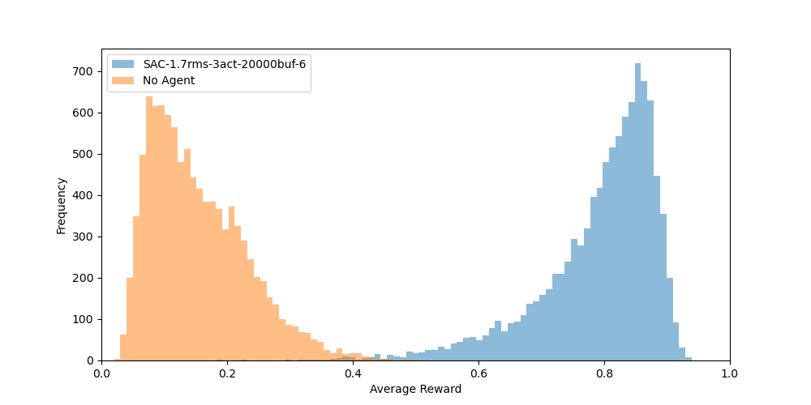

#### Evaluation for 5 zernike modes

We evaluate each agent on 1000 episodes. Each episode is 100 steps long.

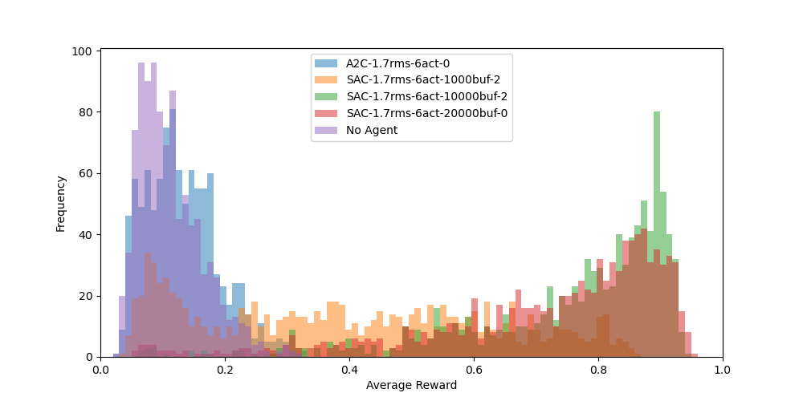

We also evaluate the best performing agent on 10000 episodes of 100 steps and compare it to the performance of the baseline.

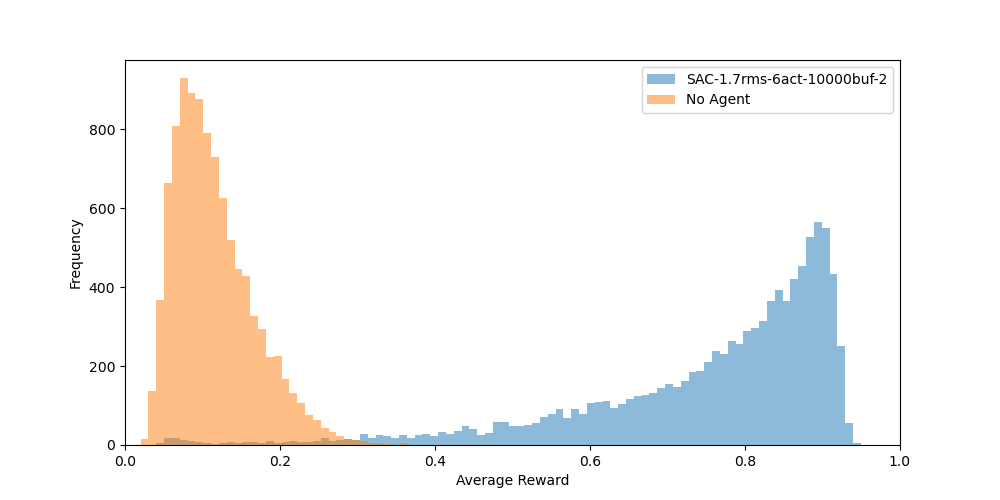

#### Evaluation for 9 zernike modes

We evaluate each agent on 1000 episodes. Each episode is 100 steps long.

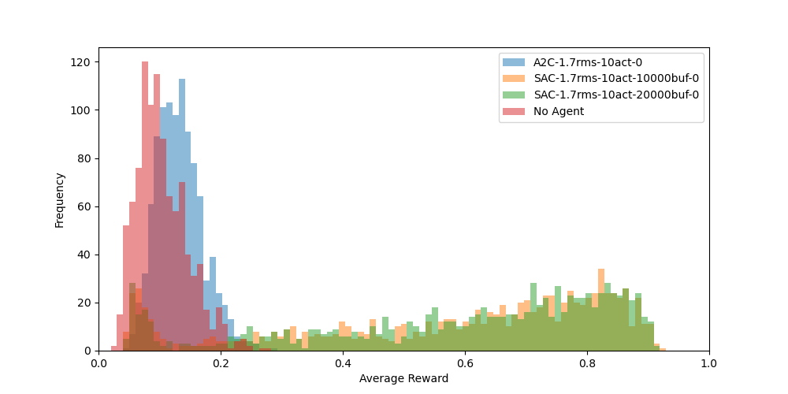

We also evaluate the best performing agent on 10000 episodes of 100 steps and compare it to the performance of the baseline.

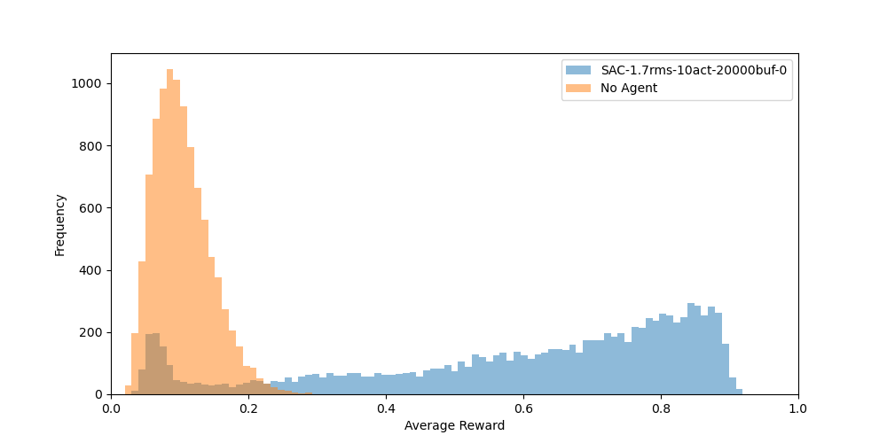

#### Evaluation for 14 zernike modes

We evaluate each agent on 1000 episodes. Each episode is 100 steps long.

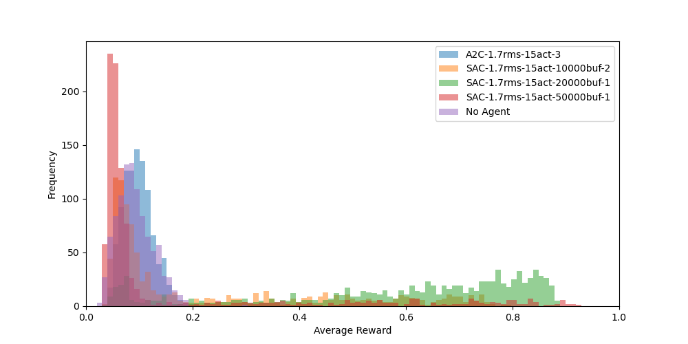

We also evaluate the best performing agent on 10000 episodes of 100 steps and compare it to the performance of the baseline.

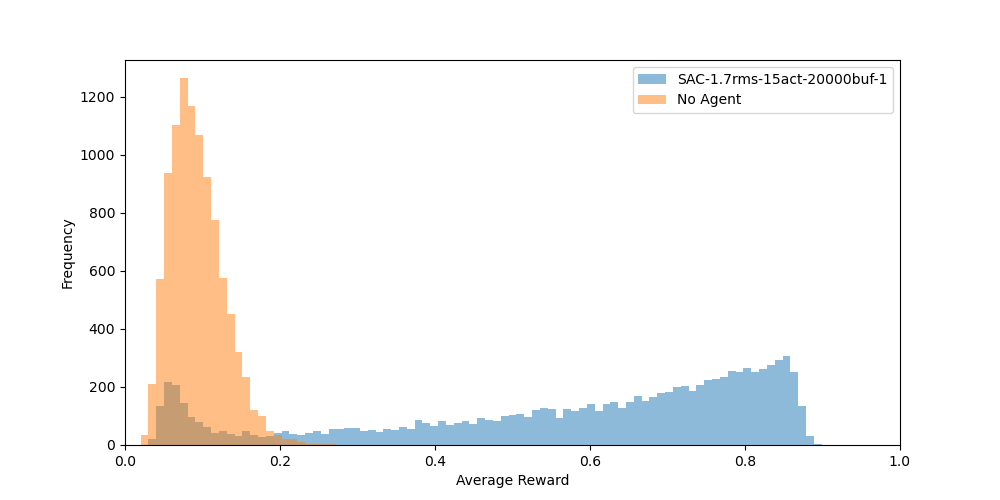

#### Evaluation for 20 zernike modes

We evaluate each agent on 1000 episodes. Each episode is 100 steps long.

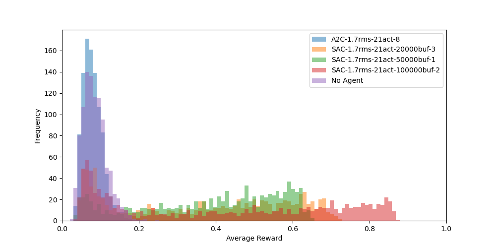

We also evaluate the best performing agent on 10000 episodes of 100 steps and compare it to the performance of the baseline.

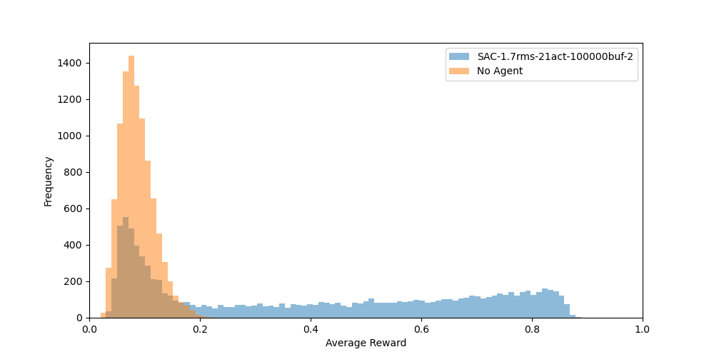


## Animations

### Sharpening easy with 20 zernike modes

#### Baseline (no agent)


#### Best agent

Our best agent is the `SAC-1.7rms-21act-100000buf-2`.


