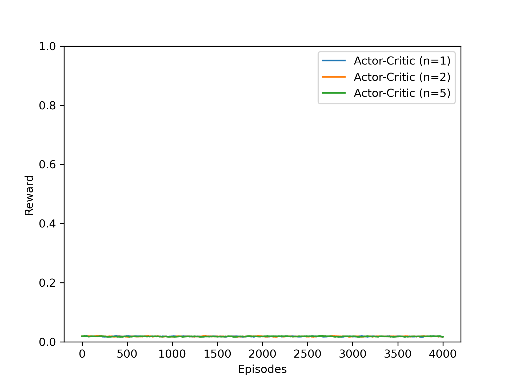

# Reinforcement Learning for Adaptive Optics

## Environments

### Image sharpening

The goal of this environment is to maximize the Strehl ratio based on focal plane images. 

- Observation: The observed (noisy) image intensity in the focal plane. The image is normalized such that the values are always between 0 and 1. The image has a size of 96x96 pixels.
- Action: An array of commands to send to the actuators to reshape the deformable mirror. This is in units of radians and should have an absolute value smaller than 0.3 to avoid divergence. Default is 400 actuators.
- Reward: The Strehl ratio, which is a measure of image sharpness and is between 0 and 1.
- Things to consider: 
    * Partially observable Markov decision process: twin image problem  (image intensity and not the electric field)
    * Possible solution: provide the agent a history of observations and commands or through the use of agents that have intrinsic memory

Run the environment with the following command:

```python gym_ao/gym_ao/gym_sharpening.py```

### Dark hole 

The goal of this environment is to remove starlight from a small region if the image. 

- Observation: A measurement with information about the electric field in the dark hole region. The shape is N_probes x N_pixels, default is 5 x 499.
- Action: An array of commands to send to the actuators to reshape the deformable mirror. This is in units of radians and should have an absolute value smaller than 0.3 to avoid divergence. Default is 400 actuators.
- Reward: The log of the contrast (mean of the image intensity in the dark hole region divided by the peak intensity of the starlight).

Run the environment with the following command:

```python gym_ao/gym_ao/gym_darkhole.py```

## Initial Test

### Image sharpening using Actor-Critic




## Notes

- Previous results were obtained with a bug in the environment. The reward was not normalized and the shape of the actions was not correct.
- We managed to fix the issue with the shape of the actions. 
- We managed to fix the issue with the normalization of the reward. We now have two options:
    * Get the average reward over the full trajectory
    * Get the reward at the end of the trajectory (n steps)
- The agent is no longer able to learn.
- We tried to play with the hyperparameters but it did not help.

## TODO

- Try on a simpler version of the environment by:
    * Reducing the number of actuators
    * Reducing the number of image error from the atmosphere
    * Use "zernike" modes instead of actuators
- Try discretizing the action space
- Try different network architectures
- Use a different agent from the stable-baselines library
- Explore the Dark hole environment


